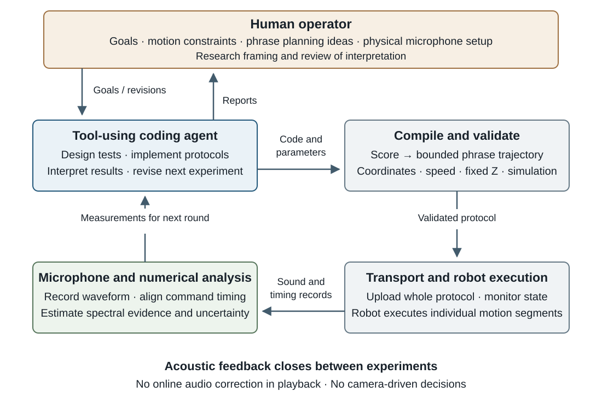

# Human–AI workflow evidence and attribution

Prepared 15 September 2026. This supplement supports manuscript version 2.0.
It is a retrospective reconstruction from operator instructions retained in the
project conversation, public technical records, and source inspection. The
conversation is not published as a complete transcript. Statements below
paraphrase requests; they are not verbatim quotations or an independently coded
human–computer interaction dataset. No device identifiers, network configuration,
or execution identifiers are included.

## Architecture

The operator and coding agent share a development session. The agent invokes
ordinary tools; the diagram is not a standalone autonomous service architecture.
The dashboard currently supports observation and inventory, not this execution
loop. The acoustic feedback returns after recordings are analyzed, before later
experiments. A playing song does not listen and retune itself.

## Human-origin decisions

| Decision | Evidence basis | Resulting role |
|---|---|---|
| Investigate motor pitch | Operator noticed different pitches during motion and asked about existing Opentrons music projects | Initiated the research question |
| Record and calibrate | Operator requested Song of Storms calibration and confirmed headset microphone connection to the Linux host | Supplied measurement access and the musical objective |
| Keep relative pitch and complete songs | Operator prioritized relative pitch, requested complete arrangements and Python entry points | Set acceptance priorities and software usability requirements |
| Reverse at phrase boundaries | Operator explicitly proposed avoiding direction changes between every pair of notes, while respecting boundaries | Contributed the motion-design principle |
| Precompose and clarify the inset | Operator requested advance composition and clarified that 5 mm was acceptable within the 100 mm working interval | Contributed execution strategy and geometry constraints |
| Quantify limits | Operator requested pitch-range and fastest-rhythm tests within official operating settings | Defined the experimental characterization task |
| Frame the work around AI | Operator raised AI-in-the-loop and closed-loop pitch confirmation, then requested architecture and human-role attribution | Defined the revised research framing |
| Add missing experiments | Operator authorized the agent to supplement missing evidence | Authorized the prospective feedback validation; its detailed design is agent-authored |

These requests show substantive human participation. They do not establish a
count of all interventions, time spent, or a percentage of human contribution.
The operator's comment that playback seemed fluent remains informal feedback.

## Agent decisions supported by artifacts

| Decision/action | Supporting record | Evidential limit |
|---|---|---|
| Test a speed-dependent spectral mapping | [Calibration report](../ot2-pitch-calibration-results.md), calibration and melody protocols | The report documents measurements, not every internal or conversational reasoning step |
| Revise from a tracked spectral line to harmonic-spacing interpretation | First and second calibration versions in the same report | Register and target notes changed; no paired perceptual improvement claim |
| Implement phrase-level direction search and whole-score composition | [Arrangement record](../ot2-music-full-arrangements.md); `choose_phrase_path` and `compose` in the song protocols | Implements a human-origin idea using deterministic enumeration |
| Select refinement conditions after the initial sweep | [Limits record](../ot2-music-limits.md) and the two experimental protocols | Adaptive exploratory sampling; no efficiency comparison |
| Design a held-out feedback experiment | [Frozen supplementary plan](feedback-experiment-plan.md) and `research/feedback_experiment.py` | Evaluates acoustic feedback, not the incremental effect of an LLM over a numerical fitter |

## Implementation boundaries

- `src/opentrons_ai/music_runner.py`: configuration checks, local controller
  lock, upload, robot analysis, command validation, execution and monitoring for
  the supported songs. Its speed caps do not authorize the 400 mm/s limit sweep.
- `protocols/ot2_happy_birthday.py`, `ot2_song_of_storms_full.py`, and
  `ot2_jingle_bells.py`: independently uploadable song sources with deterministic
  score compilation and phrase-direction search, followed by segmented motion.
- `src/opentrons_ai/research/`: numerical recording analysis and document build
  tools; the supplementary experiment adds a separately validated recording
  runner. Acoustic metrics are computed by code, not by a claimed human-like
  listening ability of the agent.
- Local raw audio and transport logs are retained outside the published tree.
  Complete agent-session prompts, model snapshot/configuration, inference costs,
  and a comprehensive intervention timeline are absent from this package.

## 研究归属说明（中文）

人提出音乐目标、提供录音的物理条件、限定运动范围，并明确提出乐句间换向与
整曲预编排。智能体把这些要求转为代码、实验和测量解释，并根据结果修订后续
方案。确定性算法完成轨迹搜索、命令验证与频谱计算。人的流畅性反馈不是盲听
结果；代码成功执行也不代表音高正确。补测由人授权、智能体设计，具体测量和
系数更新由数值工具完成，不能把反馈带来的效果全部归因于 AI。
