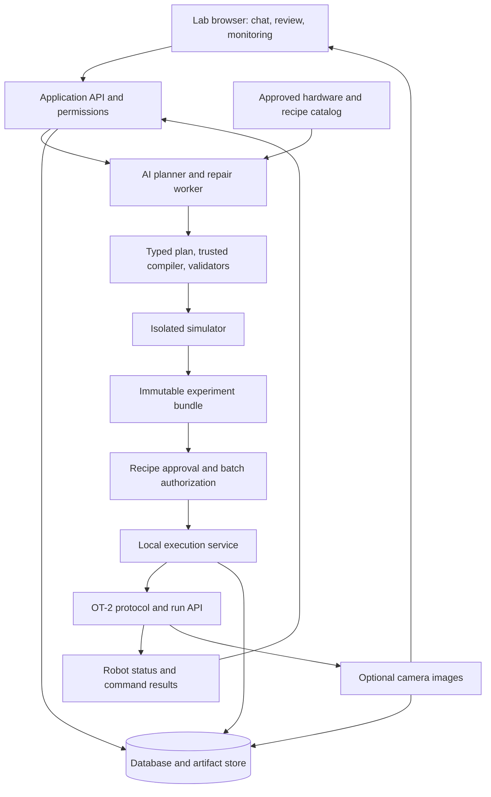

# Opentrons AI: System and Interface Design

Design date: 2026-09-14. Status: full-system specification. The observation/catalog foundation is now implemented; see [dashboard guide](dashboard.md). Later execution stages remain planned. The foundation uses single-host SQLite and a fixed-endpoint robot adapter; PostgreSQL and process/network isolation are still future execution prerequisites.

## 1. Goal and operating model

A lab team assigns liquid-handling experiments in ordinary language. The system converts each request into a reviewable experimental plan, produces an Opentrons Python script, validates and simulates it, and executes it with camera records and a complete audit trail.

Confirmed product choices: a shared browser dashboard on the lab network; liquid handling in the first version; automatic execution of previously approved recipes within approved limits.

Confirmed camera policy: images assist the operator and document runs; they are not feedback for planning, validation, approval, or execution decisions. Automatic image analysis is deferred. Other design defaults: administrators import and approve the hardware catalog through the UI, and an operator physically prepares and arms each batch. Automatic recipe execution does not authorize arbitrary new code, replenishment, or changes to the physical setup.

### Known installation

- One OT-2 connected through a locally configured USB Ethernet adapter. Connection settings are deployment-specific.
- Reported software `26.6.0`, maximum Python protocol API `2.28`.
- Left pipette: `p300_multi_gen2`, model `p300_multi_v2.1`; right mount empty; no modules reported.
- Two still images were verified at 640×480. The camera is enabled; streaming is disabled. See [camera instructions](ot2-camera.md).
- Calibration returned legacy data, an overall deck status of `OK`, and pipette tip length `0.0`. These observations do not establish readiness for liquid handling. Commissioning must resolve calibration and applicable offsets.
- Robot HTTP timestamps differed from the host. Events use host UTC plus a monotonically increasing event sequence; raw robot times are retained separately.

Initial operations: transfers, serial dilutions, reagent addition, plate setup, pipette mixing, and explicit operator checkpoints. Modules, unrestricted Python execution, autonomous calibration, and robotic plate replacement are outside the first release. The eight-channel pipette requires compatible well geometry; the planner must reject unsupported individual-well operations.

## 2. Architecture and authority



Use React with TypeScript for the browser, Python 3.12/FastAPI with Pydantic for the application, PostgreSQL for shared state and durable jobs, and local filesystem storage for immutable artifacts. Serve the UI and API through one HTTPS origin on the lab network. Use Server-Sent Events for status updates and ordinary authenticated HTTP requests for actions. No browser-to-robot requests.

Run the API, AI worker, validator/compiler worker, simulator runner, and execution service as distinct services. A PostgreSQL-backed job queue is sufficient for one robot; do not introduce a distributed orchestration platform in v1. Deploy using Docker Compose and a restricted host service for robot access. These are proposed components and must be installed during implementation.

Only the execution service can reach the USB robot network. Enforce this using network namespaces/firewall rules, not prompt instructions. It exposes a local authenticated interface to the API; it never accepts an arbitrary URL, shell command, or raw Python file from the AI. Protect the robot from competing control paths during automated operation; maintenance through the Opentrons App requires releasing automation ownership and invalidates batch arming.

The AI worker can call tools to read approved inventory, propose a plan, request validation, inspect failures, and submit a candidate job. Its tools cannot approve recipes, arm batches, change calibration, or issue robot commands. API keys belong only to this worker. Model selection is configurable; follow [OpenAI integration guidance](openai-guidance.md). Keep planning and execution functional states independent so model outages cannot disrupt an already running approved protocol.

## 3. Natural language to executable protocol

### A. Capture experimental intent

Chat produces a typed `ExperimentSpec`: objective, samples, source/destination wells, reagent identities, starting quantities and concentrations, transfers, mixing, dilution factors, final volumes, replicates, and desired checkpoints. Units are explicit and normalized. Preserve the user's wording alongside the structured interpretation.

Ask focused questions for missing scientific facts. Never invent stock concentrations, sample identities, starting volumes, or acceptable contamination rules. Show derived calculations and assumptions beside the plan. Unsupported hardware or operations produce an explanation and a proposed feasible alternative, not a silent substitution.

Example: “Prepare an eight-channel dilution series from these stocks across the selected plate.” The UI must resolve the actual stocks, dilution factor, final volumes, target columns, and approved plate/tip-rack records before generating executable work. This example is not an approved recipe or a claim that the required labware is present.

### B. Generate inspectable code through a constrained plan

The AI writes a typed operation plan and proposes test cases. A trusted, versioned compiler generates the authoritative Opentrons Python script from allowed operations: load approved labware/instruments, select tips, aspirate, dispense, mix, drop tips, delay, comment, and pause at checkpoints. The generated script is visible and downloadable.

This is the v1 meaning of AI script generation: the AI designs and revises the experiment while the compiler controls executable syntax. Free-form AI Python can be saved as a draft but is never uploaded to the robot. Raw code edits invalidate validation and cannot enter the automatic execution path. New operation primitives require reviewed compiler changes and qualification.

Generation is deterministic for the same plan, compiler version, and catalog snapshot. Embed data as safely serialized literals; no code interpolation, user imports, file/network access, dynamic evaluation, shell execution, or hidden runtime branching. Before robot upload, verify the script is exactly the compiler output for its plan. An AST check is defense in depth, not a sandbox.

### C. Validate and test

Apply independent checks that the AI cannot waive:

1. Schema and units; required inputs and supported operations.
2. Hardware allowlist, installed pipette identity, channel geometry, deck occupancy, tip compatibility, approved offsets, and robot/API compatibility.
3. Stepwise liquid accounting: source availability including dead volume, destination capacity, mixing limits, carryover policy, and total tip demand. Eight-channel operations consume eight tips and affect eight channels; shared-reservoir depletion uses the sum across channels.
4. Code provenance and forbidden operations, followed by simulation using the Opentrons SDK in a pinned, qualified container image.
5. Compare the simulated command sequence and resulting liquid ledger with the approved plan, then request robot-side analysis of the exact bundle. Require completed analysis without errors before permitting execution.

Opentrons provides [simulation interfaces](https://docs.opentrons.com/python-api/reference/execute-simulate/), but simulation is only one layer. For example, liquid labels themselves are not a guarantee of actual contents or valid loaded volumes; see [labware guidance](https://docs.opentrons.com/python-api/labware/). Simulation does not prove calibration, physical clearance, liquid identity, or pipetting accuracy.

Simulation runs without robot access, API credentials, internet access, host filesystem mounts, or a container-engine socket. Use a read-only image, non-root user, temporary output directory, one CPU, 1 GiB memory, and a two-minute default timeout. A small trusted supervisor launches fixed simulator jobs; it does not accept arbitrary container arguments. Limits can be changed by administrators after reviewing a legitimate larger workload.

AI repair is limited to three draft revisions per validation request. Each revision reruns the checks and preserves the previous failures. Unresolved problems return to the operator; the AI cannot weaken validators or change scientific inputs to make a test pass.

## 4. Hardware catalog and approvals

### Catalog

Import CSV inventory and JSON labware definitions through an admin screen. Separate an equipment model from the physical instance currently installed or loaded. Catalog entries include a stable ID, revision, approval state, exact Opentrons definition/version/hash, geometry/capacity, compatible instruments and tips, and validated operating limits. Physical instances include serial or label, location, calibration evidence, and availability.

Importing is not approval. Administrators review new entries; only approved revisions are selectable by the planner. Robot discovery proposes instrument inventory updates but cannot approve new equipment. The current pipette can seed a discovered entry; do not invent the absent labware list. Execution remains unavailable until required labware and tip racks have been supplied and approved.

Track reagent identity, lot, source well, initial volume, expiration if applicable, and validated handling settings separately. Carry estimated remaining volumes and used tips across runs; label these values as estimates based on declared setup and confirmed commands, not sensor measurements. Uncertain execution makes affected inventory uncertain and blocks reuse until reconciliation.

### Recipe approval and batch arming

| Record | Purpose | Who can create it |
| --- | --- | --- |
| RecipeVersion | Validated method, catalog revisions, compiler version, coupled parameter constraints, qualification evidence, and operator-checkpoint policy | Reviewer |
| RunBundle | Exact parameters, expanded plan, Python hash, labware hashes, offsets, analysis results, and required consumables | Validation pipeline |
| BatchAuthorization | Exact ordered bundle list, robot identity, confirmed initial deck/liquids/tips, operator, expiration | Operator |

A new recipe progresses through draft, software validation, reviewer approval for a supervised qualification run, recorded physical qualification, then approval for automatic use. Qualification uses water or an appropriate approved surrogate and records measurement acceptance criteria chosen for the method. A successful software run alone cannot qualify liquid-handling accuracy.

Approved recipes permit bounded parameter changes; both individual bounds and combined constraints are checked on every instance. Revalidate each materialized run. Changing method topology, compiler version, hardware definition, handling policy, or supported firmware invalidates automatic approval until reviewed again. Changing run parameters or offsets invalidates that bundle and any arming tied to it.

An operator arms a physically prepared batch containing a fixed ordered set of validated bundles. Default authorization expires after eight hours, and on disconnect/restart, deck intervention, inventory uncertainty, revocation, or calibration changes. Expiry blocks future starts and automatic resumes; it does not abruptly interrupt an otherwise healthy running segment.

The queue may automatically start the next authorized run only if the predicted deck and inventory state match its declared inputs. Plate replacement, tip replenishment, or reagent refill requires explicit intervention and re-arming. AI cannot append new runs to an armed batch. An unqualified recipe can only execute as an explicitly authorized supervised qualification run.

## 5. Execution, interruption, and camera behavior

Application states: `draft → needs_input → validating → ready_for_review → qualified_recipe → staged → armed → queued → running → completed`. Validation failures, blocked setup, pauses, stopped/failed runs, and `state_unknown` are explicit alternatives. Preserve the raw robot state separately; unknown robot states block transitions.

The local execution service holds exclusive robot ownership and allows one active run. Serialize start transactions in PostgreSQL and enforce a process-level lock on the host. Do not use automatic failover to a second robot controller. Every action has a persisted intent and idempotency key; repeated browser requests return the existing action. This does not claim exactly-once delivery by the OT-2.

Use the robot's protocol upload, analysis, run creation, offset application, and run-action endpoints from its checked OpenAPI schema. Persist the robot protocol/run IDs before starting. Never replay `play` after an ambiguous response: inspect the known run and command history first. Ambiguous creation or conflicting robot activity enters `state_unknown` and requires reconciliation rather than creating another run.

At start, recheck authorization, bundle hashes, connected instrument, offsets, inventory, idle state, and robot identity. Poll active runs every second with bounded timeouts. After three failed polls, show “Connection lost; robot state unknown,” block further actions/starts, and notify the operator. A disconnected robot may continue executing its loaded protocol; the application cannot promise to stop it over a failed connection.

Provide persistent Pause and Stop buttons through a control path independent of AI work. Show “requested” until the robot confirms a state change. A software Stop is not a physical emergency stop. Display the lab's documented local intervention procedure; do not assume the OT-2 has a Flex-style emergency-stop pendant. Recovery from ambiguous liquid handling requires operator reconciliation; never automatically retry an aspirate/dispense or suppress an error as a false positive.

### Camera assistance and records

Use the verified `POST /camera/picture` interface through the execution service for optional manual snapshots and best-effort pictures before/after runs or during existing operator pauses. Do not add pauses, delay a start/resume, or move the robot solely for a picture. Skip a capture if no suitable opportunity exists. Camera requests use a separate bounded task queue and must not block robot polling or Pause/Stop requests. Never silently change illumination, camera orientation, or settings during a run.

Store original JPEGs with run ID, optional checkpoint, host capture time, robot time, acquisition status, and content hash. Show age and “not live” clearly. Keep the original oblique view; a display rotation must be labeled and must not modify the evidence file. Camera status describes picture availability only, never whether the deck or experiment is safe.

The operator can view pictures alongside the expected deck and annotate them for reference. Do not implement automated deck comparison, anomaly detection, vision-based approval, or camera-driven protocol revision in v1. Physical setup is confirmed through the operator's normal preparation workflow, independently of image availability. Images cannot certify exact liquid volumes, chemical identity, sterility, calibration, all tips, or occluded labware.

Camera content, annotations, missing frames, timeouts, or capture failures cannot change recipe approval, batch authorization, inventory estimates, start/pause/resume/stop decisions, or run outcome. Record capture failures as informational events and continue the existing workflow. Operator-required checkpoints remain controlled by the recipe and explicit operator actions, not camera results. A human may independently choose the normal Pause/Stop control while viewing a picture; the camera subsystem does not initiate that action.

Continuous streaming remains off initially. Camera images stay local and are not passed to the planning AI or a vision provider. Any future on-demand AI image assistance requires a separate design change and must preserve this separation from automated decisions unless the user explicitly changes the policy.

## 6. User interface

Desktop-first, responsive for tablets. Left navigation: Experiments, Recipes, Hardware, Runs, and Administration. The global header shows robot name, connection freshness, current controller/operator, run state, and Pause/Stop when applicable. Color is supplemented by text and icons; all controls are keyboard accessible.

### Experiment workbench

```text
┌ Experiments / Draft name      Saved revision 4       OT-2: connected ┐
│ Chat and questions  │ Experiment workspace                          │
│                     │ Plan | Deck | Protocol | Tests | Approval     │
│ “Set up a dilution” │                                              │
│                     │ Objective, parameters and computed volumes   │
│ AI clarification    │ Step table with sources, destinations, tips  │
│ [answer inputs]     │ Required hardware and unresolved inputs      │
│                     │                                              │
│ [send]              │ [Validate & simulate] [Submit for review]    │
└─────────────────────┴──────────────────────────────────────────────┘
```

- **Plan:** editable structured parameters synchronized with chat; proposed changes appear as a diff before replacing a reviewed revision. Scientific assumptions remain visible.
- **Deck:** actual OT-2 numbered layout, including fixed trash; selectable approved hardware, well maps, expected liquids, tip counts, calibration/offset evidence, and side-by-side snapshot. Layout edits trigger revalidation.
- **Protocol:** read-only generated Python, download, compiler version, and links from script operations to plan steps. Expert code proposals create a draft outside the executable path.
- **Tests:** deterministic validation, simulation, robot analysis, expected volumes and tips, and physical qualification shown separately. Each failure names the affected step and offers a specific correction.
- **Approval:** exact revision, parameter envelope, qualification evidence, reviewer identity, and clear reasons if automatic execution is unavailable.

### Prepare batch

Choose qualified recipe instances, view required materials and starting quantities, confirm each physical deck item and reagent, inspect calibration/offset records, and arm the fixed batch. Offer an optional deck snapshot for reference. Display expiration and which manual interventions will pause automation. An “Arm prepared batch” action is distinct from recipe approval; missing physical preparation or validation conditions disable it with concrete explanations. Missing camera images never disable arming.

### Live run and records

```text
┌ Run 014     RUNNING     Step 18 / 64        [Pause] [Stop run] ┐
│ Expected deck and well map │ Optional reference photo         │
│ Current source/destination │ Captured 10:12 UTC — not live     │
├───────────────────────────┴───────────────────────────────────┤
│ Timeline: confirmed actions, checkpoints, and operator events │
│ Remaining tips/volume estimates │ Findings needing attention │
└───────────────────────────────────────────────────────────────┘
```

Display robot-confirmed progress rather than AI narration. Separate protocol completion, required execution records, scientific outcome, and optional image availability. Run history exports the request, interpreted plan, script, definition hashes, validation/qualification records, approvals, parameters, available images, and command/error log. Missing optional images do not make an otherwise complete run incomplete. AI may summarize non-image execution records but cannot declare experimental success without the specified measurements.

Roles: Viewer reads permitted experiments; Operator drafts, prepares, arms, pauses/stops, and reconciles runs; Reviewer also qualifies and approves recipes; Administrator manages users, inventory approval, and deployment settings. One person may hold multiple roles in a small lab; every action still records the role and identity. AI has none of these human permissions.

## 7. Application interfaces, security, and durability

Expose versioned application endpoints under `/api/v1`; these are new application contracts, not OT-2 paths:

| Interface | Behavior |
| --- | --- |
| `POST /experiments`, `POST /experiments/{id}/messages` | Create intent and request structured revisions |
| `POST /experiments/{id}/validate` | Produce a frozen validation job and run bundle |
| `POST /catalog/imports`, `POST /catalog/{id}/approve` | Stage and approve versioned inventory |
| `POST /recipes/{id}/qualify`, `POST /recipes/{id}/approve` | Record supervised qualification and activate its envelope |
| `POST /batches`, `POST /batches/{id}/arm` | Freeze a queue and authorize its physical setup |
| `POST /runs/{id}/actions` | Request start, pause, stop, or operator-reviewed resume; server validates role and state |
| `GET /runs/{id}/events`, `GET /runs/{id}/artifacts` | Stream ordered events and retrieve authorized evidence |

All mutations require authenticated users or scoped service identities, revision checks, and idempotency keys where they could create jobs or robot actions. Stale approvals return a conflict; the UI reloads the revised artifact rather than silently approving it.

Use administrator-created local accounts with Argon2id password hashes, secure HttpOnly session cookies, CSRF protection, login rate limits, and server-side role checks. No self-registration or public internet exposure in v1. Terminate TLS with a lab-trusted certificate. Keep model credentials, database credentials, robot access, and simulator privileges separate.

Treat uploaded documents, catalog text, images, and model replies as untrusted data. Prompt injection cannot grant tools or approval. Store artifacts under generated IDs, never user-controlled filesystem paths. Limit upload sizes and validate JSON before catalog approval. The AI sees only experiment-scoped records and approved tools.

Persist drafts/revisions, jobs, bundles, approvals, batch reservations, robot intents/results, events, and artifact hashes. Transactions bind resource reservations to queue changes. On host restart, do not resume automation: re-discover the robot's current run and reconcile with stored IDs. Conservative inventory reconciliation is required for partial or interrupted runs.

Take nightly database and artifact backups to a lab-managed destination; test restoration before production use. Keep run evidence until an administrator explicitly applies a retention policy. Record deletion actions; audit logs are append-only to application roles, not claimed to be tamper-proof against host administrators. Nothing uploads experiment images or logs to GitHub automatically.

## 8. Delivery stages and acceptance tests

1. **Foundation:** authenticated dashboard, approved hardware catalog, read-only robot status, manual snapshots, and mock execution adapter. Accept when only authorized users can access the lab UI and discovery cannot change equipment approval.
2. **Planning and simulation:** structured chat, compiler, liquid/tip accounting, isolated simulation, and test report UI. Accept when unsupported single-well work, missing stock concentration, impossible volumes, wrong tip geometry, and unapproved hardware are blocked with actionable messages.
3. **Supervised execution:** resolve calibration, qualify the robot/SDK combination, upload and analyze exact bundles, perform explicitly authorized water qualification, and save optional camera pictures. Require measured outcomes against method-specific tolerances before approving recipes.
4. **Bounded automation:** recipe envelopes, batch arming, inventory reservations, queue ownership, pause/recovery behavior, and evidence export. Accept only after fault tests show no duplicate start and no reuse of uncertain materials.

Backend tests use pytest and property-based tests for volume/tip accounting. Frontend uses Vitest and Playwright. Mock the OT-2 for normal CI; hardware tests run separately under operator authorization. Qualification criteria must include multichannel accounting, boundary and coupled recipe parameters, artifact tampering, stale approvals, concurrent operators, duplicate requests, network loss before/after start, worker restart, camera failure/occlusion, AI outage, and attempted prompt injection or tool privilege escalation.

Use recorded API fixtures to test the observed firmware, including unrecognized states and version changes. Verify that simulator code cannot reach the robot or secrets, the UI never equates simulation with physical validation, Stop displays acknowledgement honestly, and backups restore both metadata and pictures.

Camera isolation acceptance: replay the same experiment with the camera enabled, disabled, disconnected, returning unrelated/occluded pictures, or timing out. Approval, authorization, liquid accounting, and execution transitions must be identical unless the operator explicitly acts. Verify that captures do not insert pauses, block controls, or send images to the AI. Only optional image artifacts and informational capture events may differ.

Monitor robot connection age, run state, pending operator findings, camera freshness, queue ownership, disk space, failed jobs, and backup status. Use dashboard alerts in v1; email or messaging integrations require separate configuration.

No runtime commands or hardware readiness claims are implied by this specification. The first implementation milestone is the read-only dashboard and catalog; physical execution remains disabled until the validation and qualification stages are complete.
